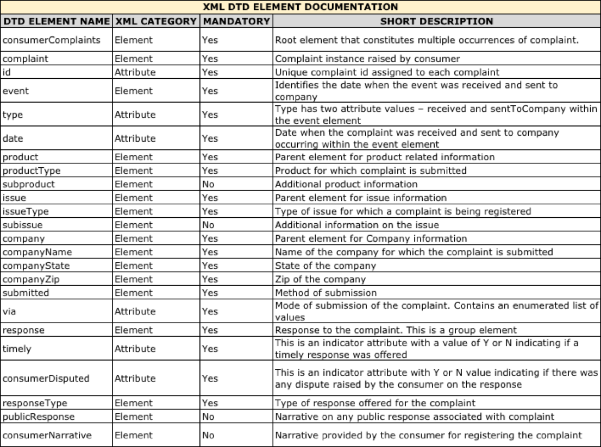
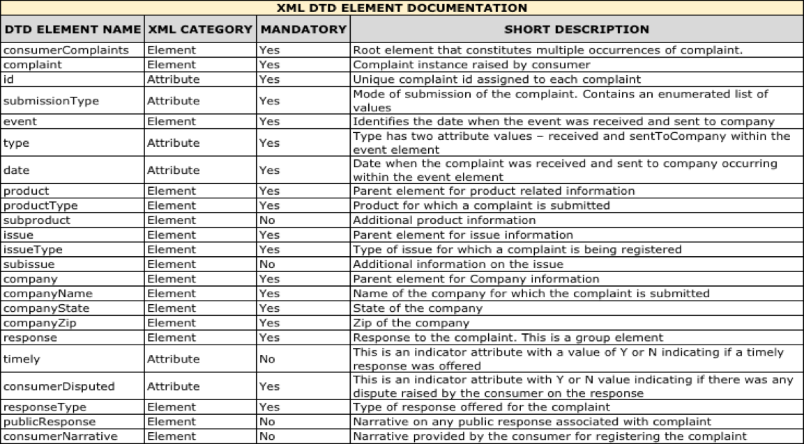
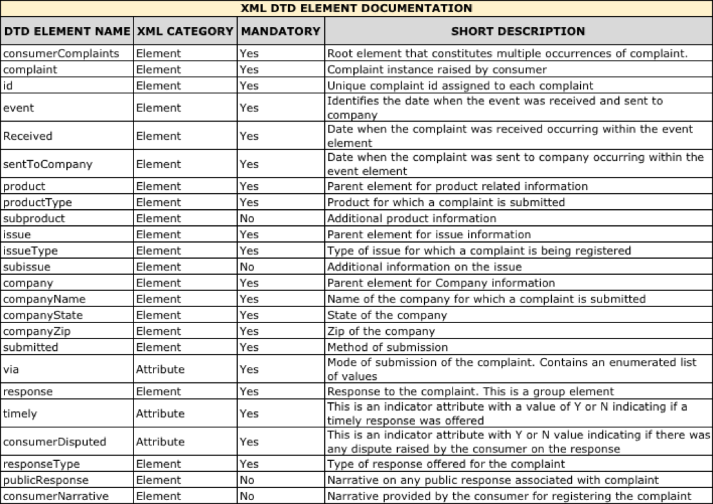
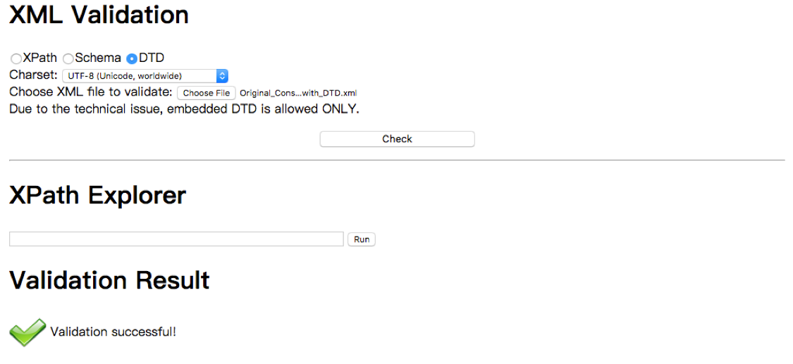
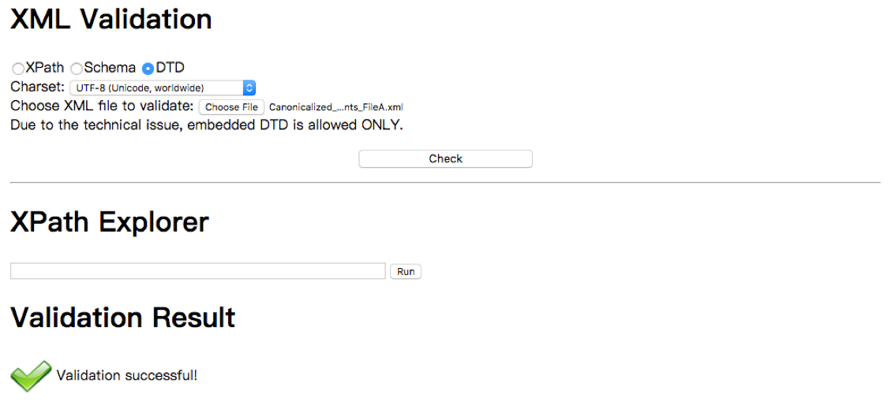
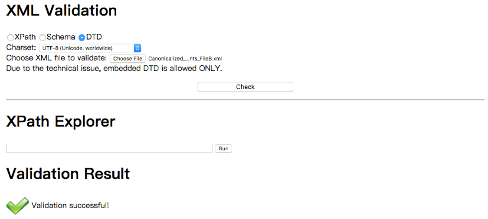
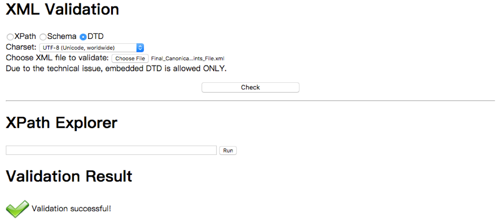

**Data Profile:**

**Consumer\_Complaints\_FileA.xml**

The file is a collection of complaints submitted by consumers for different companies through various modes of submission (Web, Referral or Phone). The XML is organized as a collection of _complaint_ elements under a single root element _consumerComplaints._ Each _complaint_ element has multiple sub elements or child elements that are associated with the complaint. Each complaint is identified by unique _id_ that is an attribute within the _complaint_ element. Each _complaint_ element has an _event_ element with two attributes _type_ &amp; _date_ that represent the date when a complaint was received and sent to a company. The _company_ element has three sub elements (_companyName, companyState, companyZip_) that represents information of a company for which a complaint is submitted. The _product_ element and its two sub elements (_productType, subproduct_) hold information about a specific consumer function for which a complaint is submitted. The _issue_ element provides information on what type of issue was encountered by the consumer (_issueType_ sub-element) and additional information on the issue (_subissue_ sub-element). _consumerNarrative_ was explanation provided by the consumer for raising the complaint or dispute. The _response_ element holds information about response or resolution to complaint from the company and the two sub-elements – _timely, consumerDisputed_ are response attributes that indicate (Y or N) if the response was timely and if there was any further dispute on the response from consumer. The _publicResponse_ sub-element holds the public response narrative. The mandatory elements &amp; function of each element/attribute is also detailed in the DTD table documentation below. The data file has minimal inconsistencies and needs canonicalization &amp; might require element/attribute reorganization to enable integration with the other file.

**MD5: ** abc4665edea350247bdcacb90dfb9b04

**SHA1:**  56ea7d9a27b7f555b493bdb73c39018e6d5c6792

**Consumer\_Complaints\_FileB.xml**

The file is a collection of complaints submitted by consumers for different companies through various modes of submission (Web, Referral or Phone). The XML is organized as a collection of _complaint_ elements under a single root element _consumerComplaints._ Each _complaint_ element has multiple sub elements or child elements that are associated with the complaint. Each complaint is identified by unique _id_ that is an attribute within the _complaint_ element which also has another attribute _submissionType_ that identifies one of the three modes of submission (Web, Phone or Referral). Each _complaint_ element has an _event_ element with two attributes _type_ &amp; _date_ that represent the date when a complaint was received and sent to a company. The _company_ element has three sub elements (_companyName, companyState, companyZip_) that represents information of a company for which a complaint is submitted. The _product_ element and its two sub elements (_productType, subproduct_) hold information about a specific consumer function for which a complaint is submitted. The _issue_ element provides information on what type of issue was encountered by the consumer (_issueType_ sub-element) and additional information on the issue (_subissue_ sub-element). _consumerNarrative_ was explanation provided by the consumer for raising the complaint or dispute. The _response_ element holds information about response or resolution to complaint from the company and the two sub-elements – _timely, consumerDisputed_ are response attributes that indicate (Y or N) if the response was timely and if there was any further dispute on the response from consumer. The _publicResponse_ sub-element holds the public response narrative. The mandatory elements &amp; function of each element/attribute is also detailed in the DTD table documentation below. The data file has several inconsistencies and needs extensive canonicalization &amp; also requires element/attribute reorganization to enable integration with the other file.

**MD5:**  1ede428d670ef18e68a3c326efb91bc4

**SHA1:**  3f6e71545833020940432547c12b1592b0663e73

**Commonality in Profile between the two datasets :**

Based on a high-level review of the datasets (old and new), almost all the elements and attributes are in common between the two files except for a few attributes in one file that is coded as an element in the other file. There are some ordering inconsistencies between the files on certain elements and also within the files like for example – in the event element the order of appearance of its attributes is different both within the file and also between the files. Similarly, not all the response elements appear in the same order within the file and also between the files. Also, there is no consistent ordering in sub-elements within the complaint element both within the file and between the files. There are also some data format inconsistencies between the files, like for example – the Yes or No indicator for one of the attributes in response element is coded as &quot;yes&quot; and &quot;no&quot; while the same attribute for response element is coded as &quot;Y&quot; and &quot;N&quot; in the other file. There are other format issues like excessive spacing between attributes, elements and their values. All these at a very high level indicate that these files require some level of canonicalization and reorganization of elements &amp; attributes including converting some of the attributes to elements and resolving inconsistencies to enable full integration. The following sections detail on how these are accomplished.

**DTD Documentation:**

**DTD table for Consumer\_Complaints\_FileA.xml**

**DTD table for Consumer\_Complaints\_FileB.xml**

**DTD table for Final\_Canonicalized\_Consumer\_Complaints.xml**

**DTD Validation:**

**DTD Validation for Original\_Consumer\_Complaints\_FileA\_with\_DTD.xml**

 
**DTD Validation for Original\_Consumer\_Complaints\_FileB\_with\_DTD.xml**

**DTD Validation for Canonicalized\_Consumer\_Complaints\_FileA\_with\_DTD.xml**

**DTD Validation for Canonicalized\_Consumer\_Complaints\_FileB\_with\_DTD.xml**

**DTD Validation for Final\_Canonicalized\_Consumer\_Complaints\_with\_DTD.xml**

**Canonicalization:**

**Canonicalization of Consumer\_Complaints\_FileB.xml**

Below were the actions performed to canonicalize the Consumer\_Complaints\_FileB.xml after careful review of the provided XML document and the generated DTD.

1. Trailing space in the _subproduct_ tag was removed.
2. Leading extra space before the attribute names within the _event_ tag was removed.
3. Removed extra space after the attribute names within the _event_ element.
4. Removed the trailing extra space from the attribute value of the _event_ tag.
5. Removed the single occurrence of empty _&lt;submitted/&gt;_ tag.
6. Removed the extra space between attribute name and element name within the _complaint_ tag.
7. Removed the trailing extra space within the _response_ tag.
8. Placed the elements within the complaint parent element consistently in the following order  - _event, product, issue, company, submitted_ and _response_ which seemed to be the order in most of the _complaint_ element occurrences in the original XML.
9. Order of appearance of attributes (_timely_ and _consumerDisputed_) within the _response_ elements has been made consistent across all occurrences. The attribute _timely_ will appear first followed by the _consumerDisputed_ attribute.
10. The attribute values for _timely_ attribute within the _response_ element has been updated to represent the value of Y for Yes and N for No consistently across all occurrences.

**MD5:** 31df4d082bcd2863115daeb91bf28338

**SHA1:** 4f965bff80d734eb517a7209d74e9a5ce11cc56d

**Canonicalization of Consumer\_Complaints\_FileA.xml**

Below were the actions performed to canonicalize the Consumer\_Complaints\_FileA.xml after careful review of the provided XML document and the generated DTD.

1. Moved event tag before the _company_ tag to keep it consistent.
2. Ensured that all the _event_ elements occurred together.
3. Ensured the _company_ and _submitted_ tags occurred before _response_ tag and _response_ is the last tag occurring within the _complaint_ element.
4. Placed the elements within the _complaint_ parent element consistently in the following order  - _event, product, issue, company, submitted_ and _response_ which seemed to be the order in most of the _complaint_ element occurrences in the original XML.

**MD5:** 48a128d50c5b13cc7f90839da2082da3

**SHA1:** a92f95f0de2be06c7ebc909182a42a541f52cc66

**Canonicalized Final Integrated XML**

Below were the actions performed to integrate the Consumer\_Complaints\_FileB.xml and Consumer\_Complaints\_FileA.xml which seemed to follow similar XML hierarchy along with element &amp; attribute names. The data profile of these two XML files indicate that they exhibit a similar functional purpose and can be integrated into one XML schema with appropriate steps. There were some additional canonicalization steps that were followed during the integration process and are included in the details below. The integration was accomplished after an element to element and attribute to attribute review of each the XML files (old and new) provided along with their respective generated DTD documents and with careful consideration to the functional purpose of each element in the context of the respective XML files.

1. Replaced entities with the actual value where possible. The redacted entity definition in the original DTD has been replaced with the actual value.
2. Converted the attributes within the _event_ element to individual elements under the event parent element. The two attributes under the event tag refer to dates and since dates are dynamic with multiple possible values, it made more sense to replace the attributes as elements.
3. Added end tags to the _event_ element.
4. Replaced the id attribute from the _complaint_ element as a new child element under the _complaint_ element. This is because id value is dynamically generated and would be logical to represent them as elements in a XML rather than attributes. Attribute representations are ideal in the case of static values associated with drop downs values or lists.
5. The _timely_ and _consumerDisputed_ attributes within the _response_ element have been updated to represent the values &quot;Yes&quot; and &quot;No&quot; as &quot;Y&quot; and &quot;N&quot; in every occurrence.
6. The _timely_ attribute has been made mandatory (#REQUIRED) unlike the Consumer\_Complaints\_FileB.xml and should either hold a value of &quot;Y&quot; or &quot;N&quot;.
7. The _submissionType_ attribute within the _complaint_ element from the Consumer\_Complaints\_FileB.xml has been integrated into the _submitted_ element under the _complaint_ parent element like in Consumer\_Complaints\_FileA.xml with the a _via_ attribute representing the mode of submission.

**MD5:** 9ba91cfba61f4ee20749e9bef5bb44d3

**SHA1:** 68e7262513c1d96e601df612537b819ed56eee8a

**Support of Data Curation Objectives :**

The canonicalized XML schema supports different curatorial activities and objectives. XML schema in general has several key benefits and some of them include platform independence, flexibility and extensibility. The XML schema above provides data export facilities in a common simple exchange format which both captures the data structure and provides a degree of clarity to the exported data. The canonicalization process itself supports reuse and preservation and ensures the data is understandable and useable in the future. The canonicalization process of ordering the elements, attributes and removing invalid characters supports reproducibility, access and reformatting, the data consistency established enables reproducing results and comparing data for equivalence and in turn ensures validity and reliability. The XML schema supports integration to different disparate data sources and different data types in the distributed data sources. Use of common exchange schemas like XML to define data structures allows to parse data &amp; organize into semantically described data objects conforming to the curatorial objectives. This schema as evident from the structure allows common information types to be represented in a syntactically defined structure thus enabling data documents to programmatically parsed into meaningful information and supports different curatorial objectives like discoverability and provenance too. The semantically consistent data representation in the XML schema above also enables sharing the data within the domains. The above schema also supports the ability to systematize data workflows. There is more work that needs to be done which has not been detailed above in terms of Security, Sharing, Workflow, Compliance and Provenance as well.

**DTD for Original and Canonicalized XML:**

**DTD for Original FileA:**

&lt;!DOCTYPE consumerComplaints [
&lt;!ELEMENT consumerComplaints ( complaint+ ) &gt;
&lt;!ELEMENT complaint ( company | consumerNarrative | event | issue | product | response | submitted )\* &gt;
&lt;!ATTLIST complaint id NMTOKEN #REQUIRED &gt;
&lt;!ELEMENT event EMPTY &gt;
&lt;!ATTLIST event date NMTOKEN #REQUIRED &gt;
&lt;!ATTLIST event type ( received | sentToCompany ) #REQUIRED &gt;
&lt;!ELEMENT product ( productType, subproduct? ) &gt;
&lt;!ELEMENT productType ( #PCDATA ) &gt;
&lt;!ELEMENT subproduct ( #PCDATA ) &gt;
&lt;!ELEMENT issue ( issueType, subissue? ) &gt;
&lt;!ELEMENT issueType ( #PCDATA ) &gt;
&lt;!ELEMENT subissue ( #PCDATA ) &gt;
&lt;!ELEMENT consumerNarrative ( #PCDATA ) &gt;
&lt;!ELEMENT company ( companyName, companyState, companyZip ) &gt;
&lt;!ELEMENT companyName ( #PCDATA ) &gt;
&lt;!ELEMENT companyState ( #PCDATA ) &gt;
&lt;!ELEMENT companyZip ( #PCDATA ) &gt;
&lt;!ELEMENT submitted EMPTY &gt;
&lt;!ATTLIST submitted via NMTOKEN #REQUIRED&gt;
&lt;!ELEMENT response ( responseType | publicResponse? )\* &gt;
&lt;!ATTLIST response consumerDisputed NMTOKEN #REQUIRED &gt;
&lt;!ATTLIST response timely NMTOKEN #REQUIRED &gt;
&lt;!ELEMENT publicResponse ( #PCDATA ) &gt;
&lt;!ELEMENT responseType ( #PCDATA ) &gt;
]&gt;

**DTD for Original FileB:**

&lt;!DOCTYPE consumerComplaints [
&lt;!ELEMENT consumerComplaints ( complaint+ ) &gt;
&lt;!ELEMENT complaint ( company | consumerNarrative | event | issue | product | response | submitted )\* &gt;
&lt;!ATTLIST complaint id NMTOKEN #REQUIRED &gt;
&lt;!ATTLIST complaint submissionType NMTOKEN #IMPLIED&gt;
&lt;!ELEMENT event EMPTY &gt;
&lt;!ATTLIST event date NMTOKEN #REQUIRED &gt;
&lt;!ATTLIST event type CDATA #REQUIRED &gt;
&lt;!ELEMENT product ( productType, subproduct? ) &gt;
&lt;!ELEMENT productType ( #PCDATA ) &gt;
&lt;!ELEMENT subproduct ( #PCDATA ) &gt;
&lt;!ELEMENT issue ( issueType, subissue? ) &gt;
&lt;!ELEMENT issueType ( #PCDATA ) &gt;
&lt;!ELEMENT subissue ( #PCDATA ) &gt;
&lt;!ELEMENT consumerNarrative ( #PCDATA ) &gt;
&lt;!ELEMENT company ( companyName, companyState, companyZip ) &gt;
&lt;!ELEMENT companyName ( #PCDATA ) &gt;
&lt;!ELEMENT companyState ( #PCDATA ) &gt;
&lt;!ELEMENT companyZip ( #PCDATA ) &gt;
&lt;!ELEMENT response ( responseType  | publicResponse? )\* &gt;
&lt;!ATTLIST response consumerDisputed NMTOKEN #REQUIRED &gt;
&lt;!ATTLIST response timely NMTOKEN #IMPLIED &gt;
&lt;!ELEMENT publicResponse ( #PCDATA ) &gt;
&lt;!ELEMENT responseType ( #PCDATA ) &gt;
&lt;!ELEMENT submitted EMPTY &gt;
&lt;!ENTITY redaction &quot;XXXX&quot;&gt;
]&gt;

**DTD for Canonicalized FileA:**

&lt;!DOCTYPE consumerComplaints [
&lt;!ELEMENT consumerComplaints ( complaint+ ) &gt;
&lt;!ELEMENT complaint ( company | consumerNarrative | event | issue | product | response | submitted )\* &gt;
&lt;!ATTLIST complaint id NMTOKEN #REQUIRED &gt;
&lt;!ELEMENT event EMPTY &gt;
&lt;!ATTLIST event date NMTOKEN #REQUIRED &gt;
&lt;!ATTLIST event type ( received | sentToCompany ) #REQUIRED &gt;
&lt;!ELEMENT product ( productType, subproduct? ) &gt;
&lt;!ELEMENT productType ( #PCDATA ) &gt;
&lt;!ELEMENT subproduct ( #PCDATA ) &gt;
&lt;!ELEMENT issue ( issueType, subissue? ) &gt;
&lt;!ELEMENT issueType ( #PCDATA ) &gt;
&lt;!ELEMENT subissue ( #PCDATA ) &gt;
&lt;!ELEMENT consumerNarrative ( #PCDATA ) &gt;
&lt;!ELEMENT company ( companyName, companyState, companyZip ) &gt;
&lt;!ELEMENT companyName ( #PCDATA ) &gt;
&lt;!ELEMENT companyState ( #PCDATA ) &gt;
&lt;!ELEMENT companyZip ( #PCDATA ) &gt;
&lt;!ELEMENT submitted EMPTY &gt;
&lt;!ATTLIST submitted via ( Web | Referral | Phone ) &quot;Web&quot;&gt;
&lt;!ELEMENT response ( responseType | publicResponse? )\* &gt;
&lt;!ATTLIST response consumerDisputed NMTOKEN #REQUIRED &gt;
&lt;!ATTLIST response timely NMTOKEN #REQUIRED &gt;
&lt;!ELEMENT publicResponse ( #PCDATA ) &gt;
&lt;!ELEMENT responseType ( #PCDATA ) &gt;
]&gt;

**DTD for Canonicalized FileB:**

&lt;!DOCTYPE consumerComplaints [
&lt;!ELEMENT consumerComplaints ( complaint+ ) &gt;
&lt;!ELEMENT complaint ( company | consumerNarrative | event | issue | product | response )\* &gt;
&lt;!ATTLIST complaint id NMTOKEN #REQUIRED &gt;
&lt;!ATTLIST complaint submissionType (Web | Referral | Phone ) &quot;Web&quot; &gt;
&lt;!ELEMENT event EMPTY &gt;
&lt;!ATTLIST event date NMTOKEN #REQUIRED &gt;
&lt;!ATTLIST event type CDATA #REQUIRED &gt;
&lt;!ELEMENT product ( productType, subproduct? ) &gt;
&lt;!ELEMENT productType ( #PCDATA ) &gt;
&lt;!ELEMENT subproduct ( #PCDATA ) &gt;
&lt;!ELEMENT issue ( issueType, subissue? ) &gt;
&lt;!ELEMENT issueType ( #PCDATA ) &gt;
&lt;!ELEMENT subissue ( #PCDATA ) &gt;
&lt;!ELEMENT consumerNarrative ( #PCDATA ) &gt;
&lt;!ELEMENT company ( companyName, companyState, companyZip ) &gt;
&lt;!ELEMENT companyName ( #PCDATA ) &gt;
&lt;!ELEMENT companyState ( #PCDATA ) &gt;
&lt;!ELEMENT companyZip ( #PCDATA ) &gt;
&lt;!ELEMENT response ( responseType  | publicResponse? )\* &gt;
&lt;!ATTLIST response consumerDisputed NMTOKEN #REQUIRED &gt;
&lt;!ATTLIST response timely NMTOKEN #IMPLIED &gt;
&lt;!ELEMENT publicResponse ( #PCDATA ) &gt;
&lt;!ELEMENT responseType ( #PCDATA ) &gt;
&lt;!ENTITY redaction &quot;XXXX&quot;&gt;
]&gt;

**DTD for Final Canonicalized File:**

&lt;!DOCTYPE consumerComplaints [
&lt;!ELEMENT consumerComplaints ( complaint+ ) &gt;
&lt;!ELEMENT complaint (id | company | consumerNarrative | event | issue | product | response | submitted)\* &gt;
&lt;!ELEMENT id ( #PCDATA ) &gt;
&lt;!ELEMENT event (received,sentToCompany)\* &gt;
&lt;!ELEMENT received ( #PCDATA ) &gt;
&lt;!ELEMENT sentToCompany ( #PCDATA ) &gt;
&lt;!ELEMENT product ( productType, subproduct? ) &gt;
&lt;!ELEMENT productType ( #PCDATA ) &gt;
&lt;!ELEMENT subproduct ( #PCDATA ) &gt;
&lt;!ELEMENT issue ( issueType, subissue? ) &gt;
&lt;!ELEMENT issueType ( #PCDATA ) &gt;
&lt;!ELEMENT subissue ( #PCDATA ) &gt;
&lt;!ELEMENT consumerNarrative ( #PCDATA ) &gt;
&lt;!ELEMENT company ( companyName, companyState, companyZip ) &gt;
&lt;!ELEMENT companyName ( #PCDATA ) &gt;
&lt;!ELEMENT companyState ( #PCDATA ) &gt;
&lt;!ELEMENT companyZip ( #PCDATA ) &gt;
&lt;!ELEMENT submitted EMPTY &gt;
&lt;!ATTLIST submitted via ( Web | Referral | Phone ) &quot;Web&quot; &gt;
&lt;!ELEMENT response ( responseType | publicResponse? )\* &gt;
&lt;!ATTLIST response consumerDisputed NMTOKEN #REQUIRED &gt;
&lt;!ATTLIST response timely NMTOKEN #REQUIRED &gt;
&lt;!ELEMENT publicResponse ( #PCDATA ) &gt;
&lt;!ELEMENT responseType ( #PCDATA ) &gt;
]&gt;
